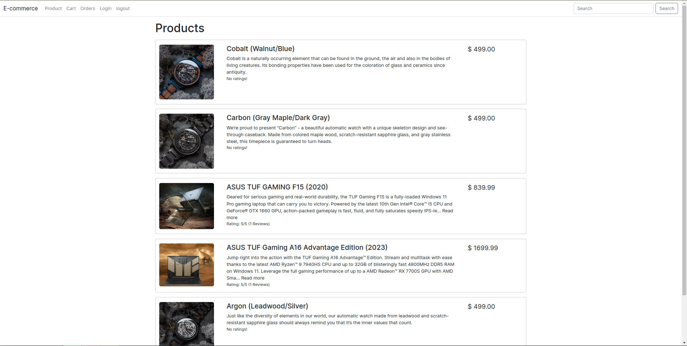
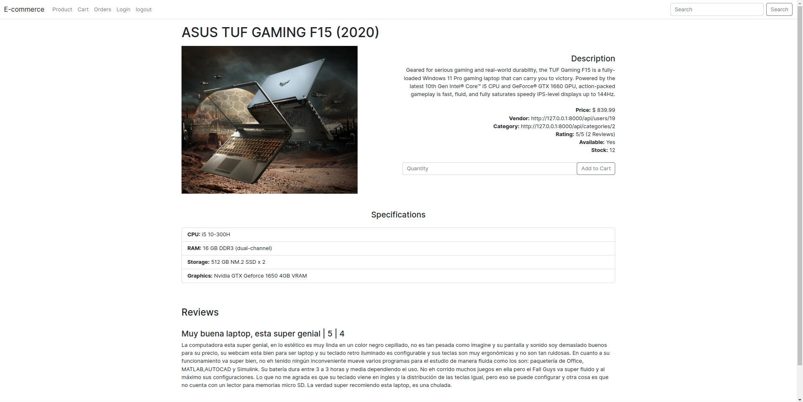
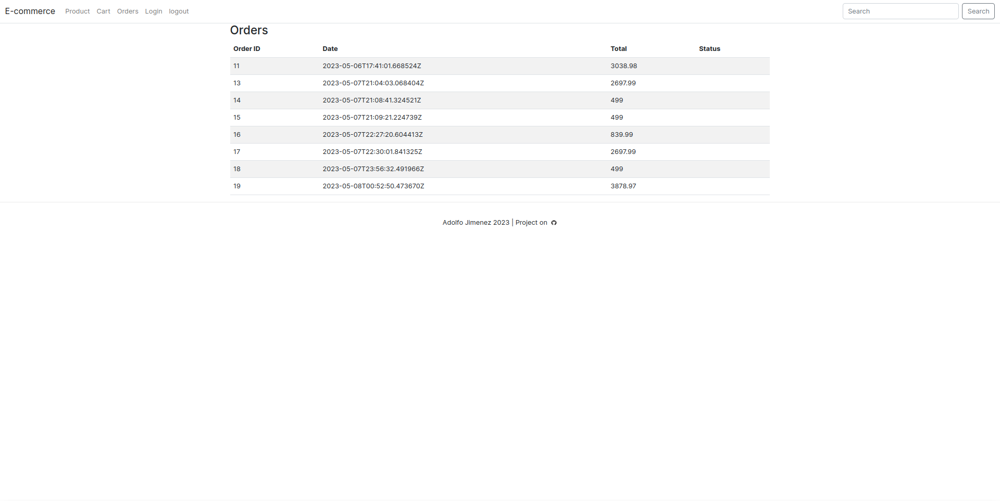
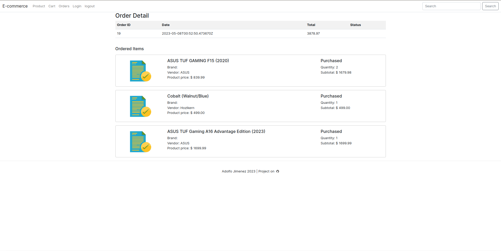

## E Commerce Netx.Js App

### Description
This APP integrates with the [E-Commerce-API](https://github.com/Eadwulf/e-commerce-API), an API that I developed with Django, Django Rest Framework, and a PostgreSQL database.

### In development, but
So far this app possesses functionalities for product listing, product details, shopping cart, checkout, order listing, and order details.

### App Screenshots

#### Products List

#### Product Details

#### Shopping Cart

#### Order List

#### Order Details

